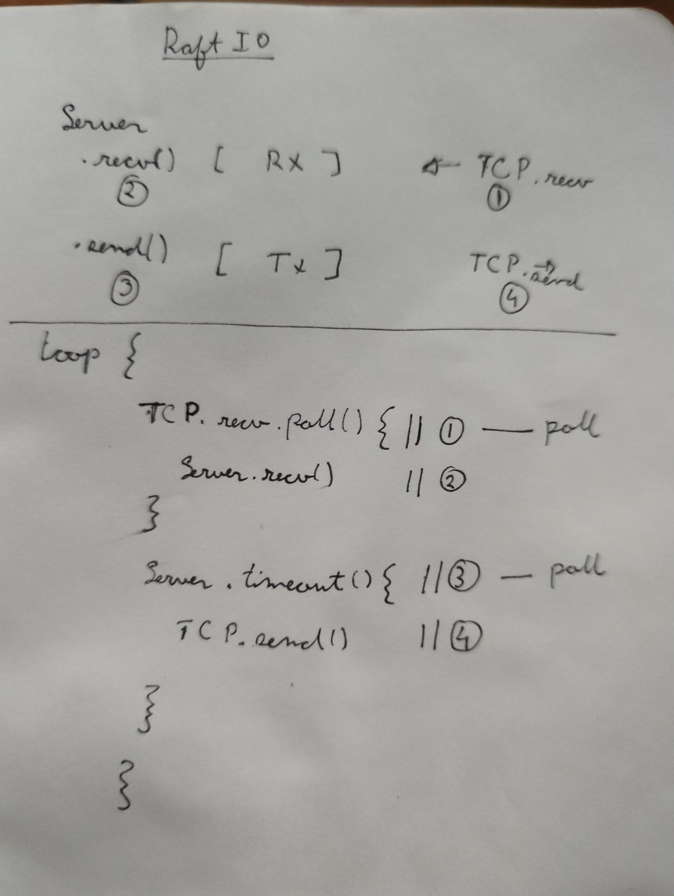
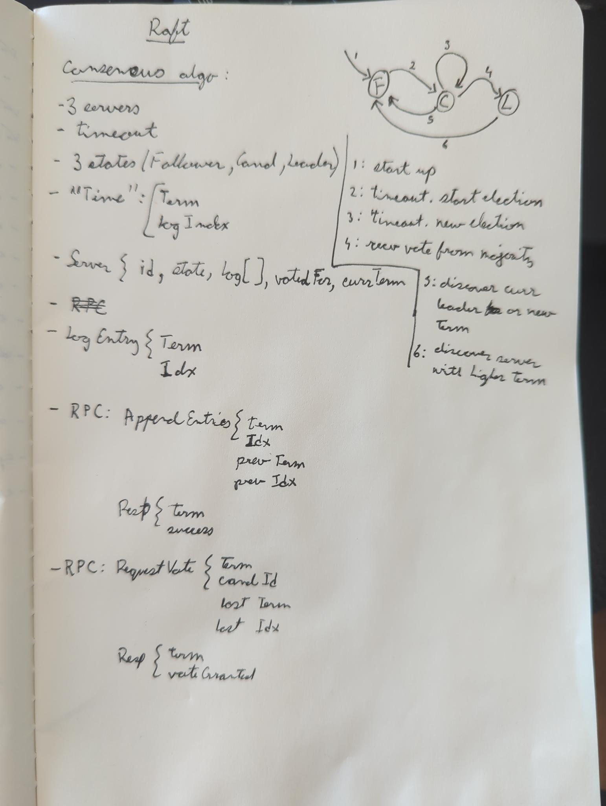

# raft-rs

A toy implementation to better understand the [Raft](https://toidiu.com/reads/In_Search_of_an_Understandable_Consensus_Algorithm_(Extended_Raft).pdf) consensus protocol

## Tasks
Remaining tasks to complete:
- [x] IO
- [ ] implement rules for All servers
- [ ] implement rules for Candidates
- [ ] implement rules for Follower
- [ ] implement rules for Leader

## Fig 2
### State
- TODO

### AppendEntries
- TODO

### RequestVote
- [x] Reply false if term < currentTerm (§5.1)
- [x] If votedFor is null or candidateId, grant vote (§5.2, §5.4)
  - [x] and candidate’s log is at least as up-to-date as receiver’s log, grant
    vote (§5.2, §5.4)

### Rules for Servers **All Servers:**
- [ ] If commitIndex > lastApplied: increment lastApplied, apply
  log[lastApplied] to state machine (§5.3)
- [x] If RPC request or response contains term T > currentTerm: set currentTerm
  = T, convert to follower (§5.1)

**Followers (§5.2):**
- [x] Respond to RPCs from candidates and leaders
- [x] If election timeout elapses without receiving AppendEntries RPC from
  current leader or granting vote to candidate: convert to candidate

**Candidates (§5.2):**
- [x] On conversion to candidate, start election:
  - [x] Increment currentTerm
  - [x] Vote for self
  - [x] Reset election timer
  - [x] Send RequestVote RPCs to all other servers
- [ ] If votes received from majority of servers: become leader
- [ ] If AppendEntries RPC received from new leader: convert to follower
- [ ] If election timeout elapses: start new election

**Leaders:**
- [ ] Upon election: send initial empty AppendEntries RPCs (heartbeat) to each
  server; repeat during idle periods to prevent election timeouts (§5.2)
- [ ] If command received from client: append entry to local log, respond after
  entry applied to state machine (§5.3)
- [ ] If last log index ≥ nextIndex for a follower: send AppendEntries RPC with
  log entries starting at nextIndex
- [ ] If successful: update nextIndex and matchIndex for follower (§5.3)
- [ ] If AppendEntries fails because of log inconsistency: decrement nextIndex
  and retry (§5.3)
- [ ] If there exists an N such that N > commitIndex, a majority of
  matchIndex[i] ≥ N, and log[N].term == currentTerm: set commitIndex = N (§5.3,
  §5.4).

## Research

### Design

### Notes from [TIKV](https://github.com/tikv/raft-rs)

> A complete Raft model contains 4 essential parts:
>
> - Consensus Module, the core consensus algorithm module;
> - Log, the place to keep the Raft logs;
> - State Machine, the place to save the user data;
> - Transport, the network layer for communication.

`struct StateMachine`

"Replicated state machine". The concept that the same data is spread over many
machines so the failure of minority of machines doesnt impact liveliness.

`struct ReplicatedLog`

Replicated state machines are implemented via a "replicated log", which are a serive of
commands to be executed in-order.

`struct ConsensusAlgo`

The job of the "consensus algorithm" is keeping the replicated log consistent.

The consensus algo on a server receives commands from a client and adds them it its
log. It then commicumates with other consensus algo on other servers to ensure that
every log contains the same commands in the same order.

3 properties
- Leader Election
- Log Repliation: leader manages replicated log
- Safety: entries added to the state machine are absolute and correct

---
## Resources
- https://toidiu.com/reads/In_Search_of_an_Understandable_Consensus_Algorithm_(Extended_Raft).pdf
- https://web.stanford.edu/~ouster/cgi-bin/papers/OngaroPhD.pdf
- https://notes.eatonphil.com/2023-05-25-raft.html
- https://github.com/jmsadair/raft
- https://github.com/tikv/raft-rs
- https://notes.eatonphil.com/2023-05-25-raft.html
- https://raft.github.io/
- http://dabeaz.com/raft.html

